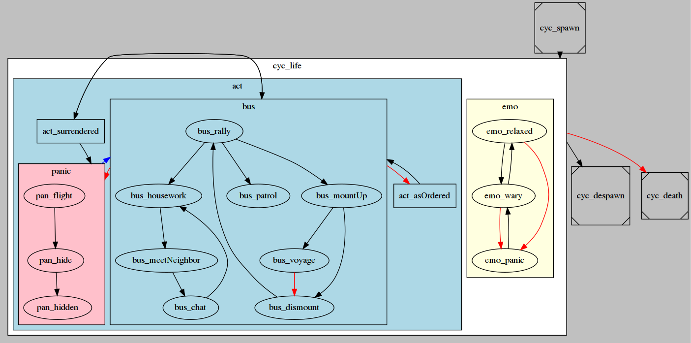

# GRAD Civilians

Spawn ambient civilians on the map.

## Features

Automatically populate the map with civilians who live in their own houses, go for long walks and short chats with their nightbors, or drive around the country.
Civilians can interact with players in various ways - surrendering when threatened with violence, hiding in panic when violence actually happens. 
They will halt their cars if signaled to stop, or move out of the way when getting honked at. If you're lucky they will even back up their vehicles if being told to do so (known unreliable).
Civilian *players* will get help trying to mimikry AI civilians by getting hints as to the interactions players perform that AI civilians would "notice".
Mission makers can use a bunch of options to clothe their civilians, get CBA events to detect players stealing civilian vehicles, and can restrict civilians to certain areas of the map.
Zeus gets some modules & menu entries too, ZEN mod is recommended to make use of all of them.

The mod is meant to make use of Headless Clients, no extra configuration necessary.

## Dependencies

* [CBA_A3](https://github.com/CBATeam/CBA_A3)
* [ACE3](https://github.com/acemod/ACE3)
* optional: [ZEN](https://github.com/zen-mod/ZEN/) adds some context menus for Zeus
* optional: [Gruppe Adler Mod](https://github.com/gruppe-adler/gruppe_adler_mod/) to enable having livestock onto trucks

## Installation

Do grab a zip file from the releases page, or look it up on the Steam Workshop where it may or may not appear sometime.

## Usage Notes

To avoid micro lags / fps dips on the server, it is recommended to add a headless client to your scenarios.

If that is not possible, civilian group size (looking at you, [Ikarus 260](https://de.wikipedia.org/wiki/Ikarus_260)!) as well as total population count should be kept small.

Civilians on separate islands can run into pathing problems. Avoid by creating exclusion zones.

## Detailed documentation

should be found for the distinct modules: 

* [activities](addons/activities/README.md)
* [cars](addons/cars/README.md)
* [cba_statemachine](addons/cba_statemachine/README.md)
* [common](addons/common/README.md)
* [diagnostics](addons/diagnostics/README.md)
* [gta](addons/gta/README.md)
* [interact](addons/interact/README.md)
* [lifecycle](addons/lifecycle/README.md)
* [loadout](addons/loadout/README.md)
* [main](addons/main/README.md)
* [mimikry](addons/mimikry/README.md)
* [patrol](addons/patrol/README.md)
* [residents](addons/residents/README.md)
* [transit](addons/transit/README.md)
* [voyage](addons/voyage/README.md)
* [zeus](addons/zeus/README.md)

## Config

Settings can be found as CBA Addon settings.

Attribute                | Default Value | Explanation
-------------------------|---------------|------------------------------------------------------------------------------------------------------------------------------------------------
backpackProbability      | 0.5            | Probability that a civilian will wear a backpack
backpacks                | []            | All classnames of backpacks that civilians may wear.
clothes                  | []            | All classnames of clothes that civilians may wear.
debugFps                 | 0             | Toggles fps monitoring mode (0/1).
faces                    | []            | All classnames of faces that civilians may have.
goggles                  | []            | All classnames of goggles that civilians may wear.
headgear                 | []            | All classnames of headgear that civilians may wear.
initialGroupSize         | 3             | Initial group size for civilians, between 1..N . Value may be any valid parameter to the `random` command.
maxCivsInVehicles        | 10            | Maximum number of civs in vehicles.
maxCivsOnFoot            | 30            | Maximum number of civs on foot.
maxCivsResidents         | 20            | Maximum number of civs that are residents, mostly doing their thing at home.
panicCooldown            | [15,120,240]  | Time it takes until a civilian relaxes after panicking (trivariate: [lowest, median, highest])
spawnDistancesInVehicles | [1500,6000]   | Minimum and maximum distance to players that civilians in vehicles can spawn in.
spawnDistancesOnFoot     | [1000,4500]   | Minimum and maximum distance to players that civilians on foot can spawn in.
spawnDistancesResidents  | [500, 1000]   | Minimum and maximum distance to players that civilians living in houses spawn in.

## API

see the various module READMEs 

### EVENTS

#### global

common events:

    ["grad_civs_civKilled", { params ["_deathPos", "_killer", "_civilian"]; }] call CBA_fnc_addEventHandler;

    ["grad_civs_vehicleTheft", { params ["_vehicle", "_thief"]; }] call CBA_fnc_addEventHandler;

## Development

* we're using the CBA state machine implementation, see `addons/*/functions/fn_sm_*/`
* there's also some extensions being done to the CBA state machnie implementation to allow for nested states and other shenanigans, see [`addons/cba_statemachine`](addons/cba_statemachine/README.md)
* if you add states or transitions, do update the DOT files in `/docs` 
* also, install [Graphviz](https://graphviz.gitlab.io/) and generate graphs using `dot -Tsvg states.gv > states.svg` etc or use an online editor   

### State Machines

This is the current structure:

see `addons/*/fnc_sm*.sqf` for all the places where state machines are defined/added to.
